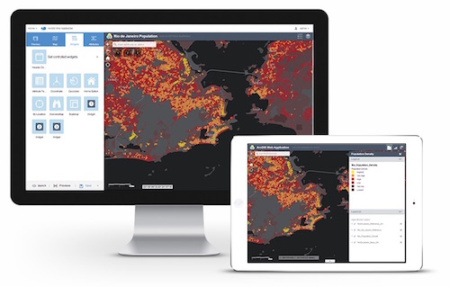

ArcGIS Web AppBuilder Community
====================

## Introductions
This repo is for the Web AppBuilder developer community to share their widgets and themes.

To properly share your widgets and themes, please read and follow the instruction from the [Widget Package](widgets/README.md) and [Theme Package](themes/README.md) notes.

## Resources
* Visit the [developers site of Web AppBuilder for ArcGIS](https://developers.arcgis.com/web-appbuilder/) to for more information about:
    * Downloading the latest release for Web AppBuilder
    * Quick guide for using Web AppBuilder
    * Widget and theme developers guide
    * The API reference for app framework and JSON reference for app / widget configuration.

* [ArcGIS for JavaScript API Resource Center](http://developers.arcgis.com)
* [ArcGIS Blog](http://blogs.esri.com/esri/arcgis/)
* [twitter@esri](http://twitter.com/esri)

## Issues
Find a bug or request a new feature? Please let us know by submitting an issue.

## Contributing
Anyone and everyone is welcome to contribute. Please refer to [guidelines for contributing](https://github.com/esri/contributing). Esri contributed widgets and themes in this repository are open sourced. Any changes made on them are not supported unless they are rolled into the future releases of Web AppBuilder.

## Licensing
Copyright 2013 Esri

Licensed under the Apache License, Version 2.0 (the "License"); you may not use this file except in compliance with the License. You may obtain a copy of the License at

   http://www.apache.org/licenses/LICENSE-2.0

Unless required by applicable law or agreed to in writing, software distributed under the License is distributed on an "AS IS" BASIS, WITHOUT WARRANTIES OR CONDITIONS OF ANY KIND, either express or implied. See the License for the specific language governing permissions and limitations under the License.

A copy of the license is available in the repository's [license.txt](license.txt) file.

